# Лабораторная работа №6: Система контроля версий

**Студент:** Мясников Иван

**Группа:** 4314

## Описание работы

Цель лабораторной работы: изучение базовых возможностей системы
управления версиями, опыт работы с Git Api, опыт работы с локальным и
удаленным репозиторием.

## Содержание
1. [Форк репозитория LR6](#форк-репозитория-lr6)
2. [Установка Git](#установка-git)
3. [Клонирование репозитория](#клонирование-репозитория)
4. [Добавление файла в GitHub и подтягивание изменений](#добавление-файла-в-github-и-подтягивание-изменений)
5. [История операций для каждой из веток](#история-операций-для-каждой-из-веток)
6. [Просмотр последних изменений](#просмотр-последних-изменений)
7. [Создание коммита через специальный редактор - VSCode](#создание-коммита-через-специальный-редактор---vscode)
8. [Слияние веток и разрешение конфликтов](#слияние-веток-и-разрешение-конфликтов)
9. [Удаление побочной ветки](#удаление-побочной-ветки)
10. [Откат коммита](#откат-коммита)
11. [Создание ветки для отчёта](#создание-ветки-для-отчёта)


## Форк репозитория LR6
1. Переходим на страницу репозитория [LR6](https://github.com/Kurtyanik/LR6)

2. Нажимаем кнопку "Fork" в правом верхнем углу страницы.

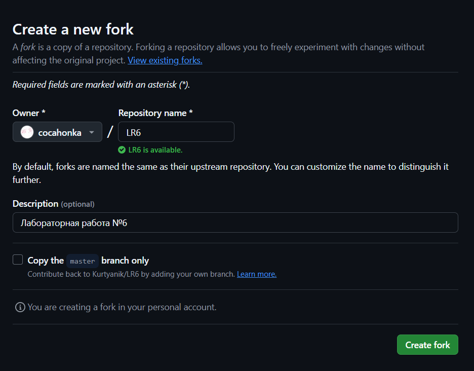

## Установка Git
1. Скачиваем установщик Git с [официального сайта](https://git-scm.com/).

2. Запускаем установщик и следуем инструкциям.

3. Настраиваем имя пользователя и email:
```bash
git config --global user.name "cocahonka"
git config --global user.email cocahonka@gmail.com
```

## Клонирование репозитория
1. Клонируем репозиторий на локальную машину:
```bash
git clone https://github.com/cocahonka/LR6.git
```

## Добавление файла в GitHub и подтягивание изменений
1. Нажатием кнопки "Add file" -> "Upload files" добавляем [файл](assets/1.create_fork.png) в репозиторий.

2. Подтягиваем изменения на локальную машину:
```bash
git pull
```

## История операций для каждой из веток
1. Получил историю коммитов для всех веток с помощью команды:
```bash
git log --all --graph --decorate --oneline
```

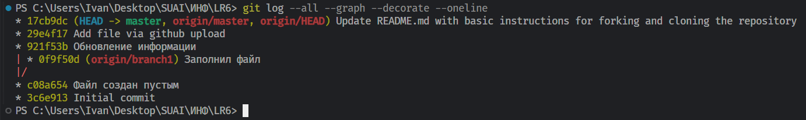

## Просмотр последних изменений
1. Для просмотра изменений последнего коммита выполнил:
```bash
git log -p -1
```

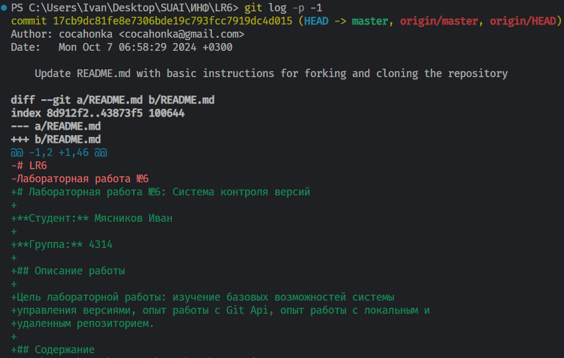
2. Для просмотра незафиксированных изменений использовал:
```bash
git diff
```

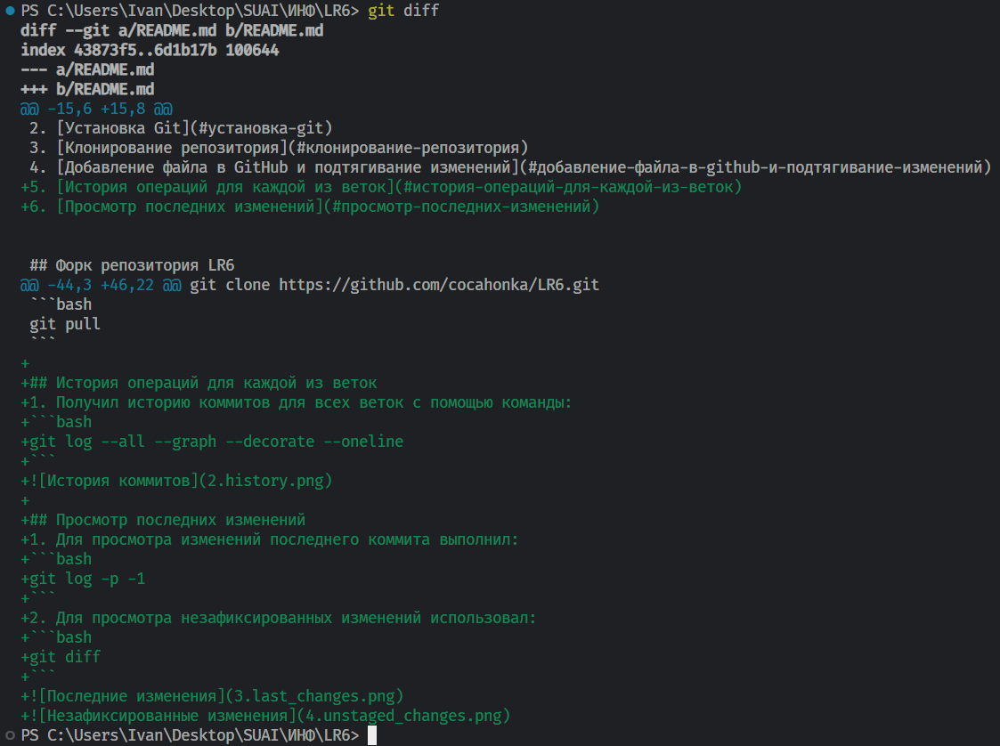

## Создание коммита через специальный редактор - VSCode
1. В разделе Sources Control выбрал файлы, которые хочу закоммитить, добавил файлы в индекс, ввел сообщение коммита и нажал "Commit"
    - Можно было бы использовать комбинацию комманд `git add .` и `git commit -m "message"`
    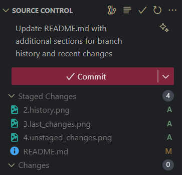

2. Синхронизировал изменения с удаленным репозиторием при помощи "Sync Changes"
    - Можно было бы использовать команду `git push`
    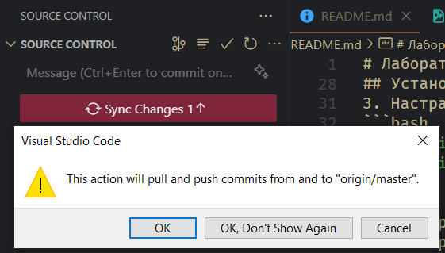

## Слияние веток и разрешение конфликтов
1. Переключился на ветку `master`:
```bash
git checkout master
```

2. Вывел список веток, в том числе удаленных:
```bash
git branch -a
```

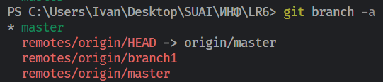

3. Слил удаленную ветку `origin/branch1` в ветку `master`:
```bash
git merge origin/branch1
```

4. Разрешил конфликт в файле [merge.txt](mergefile.txt) при помощи "Merge Resolve" в VSCode (принял версию из ветки `master`).

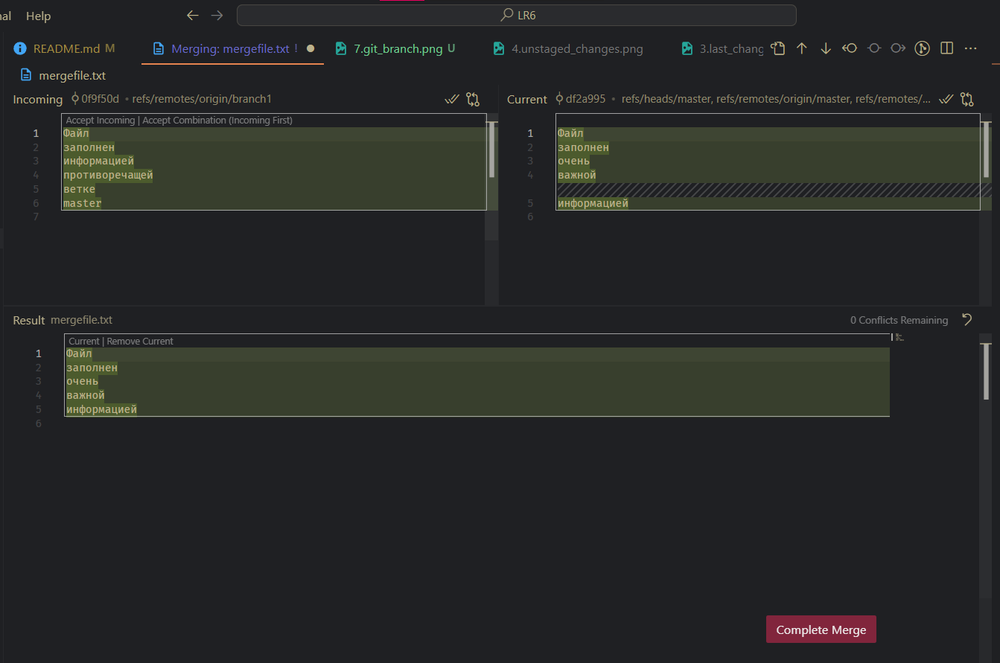

## Удаление побочной ветки
1. Убедился, что нахожусь в ветке `master`.

2. Удалил локальную ветку:
```bash
git branch -d branch1
```

3. Удалил удаленную ветку:
```bash
git push origin --delete branch1
```

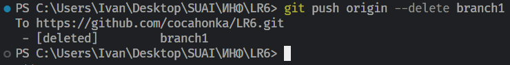

## Откат коммита
1. Получил историю коммитов:
```bash
git log --oneline
```

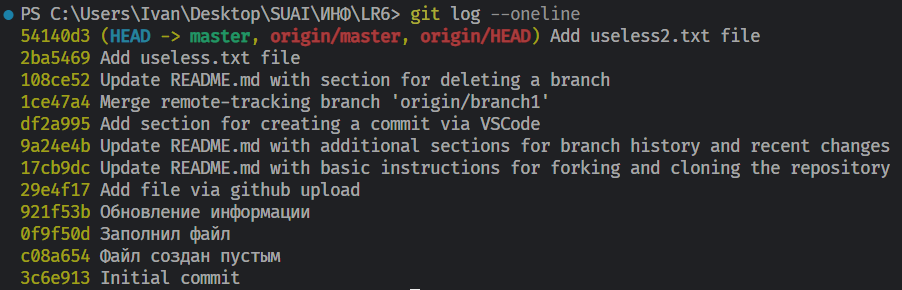

2. Отменил изменения коммита, добавляющего useless.txt, при помощи revert:
```bash
git revert 2ba5469
```

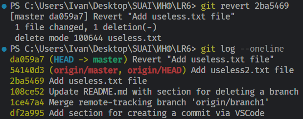

3. Откатил изменения коммита, добавляющего useless2.txt, при помощи reset, после удалил из индекса:
```bash
git reset HEAD~2
```

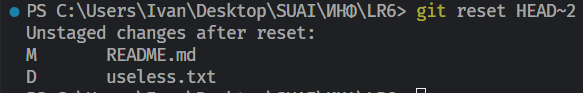

## Создание ветки для отчёта
1. Создал новую ветку report и переключился на неё:
```bash
git checkout -b report
```
